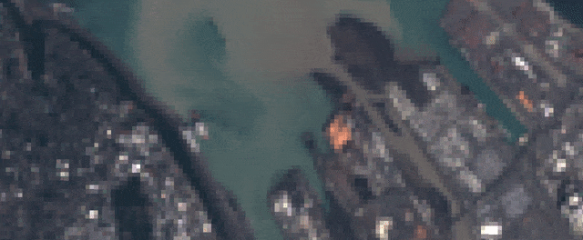

# geeSharp

[](https://developers.google.com/earth-engine/tutorials/tutorial_api_01)
[](https://code.earthengine.google.com/8fb1023faea362e87adb08c5cf7c9cc1)

Pan-sharpen multispectral imagery in the [Google Earth Engine](https://earthengine.google.com/) Code Editor with one line of code:

```javascript
var sharp = geeSharp.sharpen(ms, pan);
```




## Usage
### Pan-sharpening

To pan-sharpen an image, separate the lower resolution multispectral bands and the higher resolution panchromatic band into two images and pass them to the `geeSharp.sharpen` function. For example:

```javascript
// Import the geeSharp module
var geeSharp = require("users/aazuspan/geeSharp:geeSharp");

// Load an example Landsat 8 TOA image to sharpen
var img = ee.Image("LANDSAT/LC08/C01/T1_TOA/LC08_047027_20160819");

// Select the 30 m spectral bands to sharpen
var ms = img.select(["B4", "B3", "B2"]);
// Select the 15 m panchromatic band
var pan = img.select(["B8"]);

// Pan-sharpen!
var sharpened = geeSharp.sharpen(ms, pan);
```

By default, pansharpening in `geeSharp` uses the Smoothing Filter-based Intensity Modulation (SFIM) algorithm because it is fast and produces consistent, high-quality results. However, you may want to experiment with other methods. You can do that by passing an algorithm name to the `sharpen` function.

```javascript
var method = "brovey";
var sharpened = geeSharp.sharpen(ms, pan, method);
```

Most sharpening functions just require the unsharpened multispectral bands and the high-resolution panchromatic band as inputs, but some algorithms (like Gram-Schmidt) may accept other parameters. You can add those parameters after the method name when calling `sharpen`.

```javascript
// The Gram-Schmidt algorithm may require additional parameters depending on the size of your image.
var method = "GS";
var geom = ee.Geometry.Point([-122.41676185101713, 47.26851080476613]).buffer(1000);
var scale = 30;
var maxPixels = 1e13;

var sharpened = geeSharp.sharpen(ms, pan, method, geom, scale, maxPixels);
```

Print `geeSharp.methods` for a full list of supported algorithms, and see the [documentation](https://github.com/aazuspan/geeSharp.js/wiki/Sharpening-Functions) for descriptions.

### Image quality assessment

Image quality metrics measure the distortion between a reference image and an image that has been modified, such as a pan-sharpened image. 

```javascript
// Choose a metric
var metric = "RMSE";
// Reproject the unsharpened image to the sharpened resolution
var reproj = unsharpened.resample("bicubic").reproject(sharpened.projection());
// Calculate the metric
var quality = geeSharp.quality(reproj, sharpened, metric);
```

Note that quality metrics are affected by spatial resolution, so when comparing unsharpened and pan-sharpened images, **always resample and reproject** the unsharpened image to high resolution first to ensure an accurate comparison!

Most quality metrics just require an unmodified and a modified image and return a dictionary mapping band names to metric values, but some metrics require other parameters (e.g. `ERGAS` requires the high and low spectral resolution) and some return a single image-wise value (e.g. `RASE` and `ERGAS`). Print `geeSharp.metrics` for a full list of supported metrics and see the [documentation](https://github.com/aazuspan/geeSharp.js/wiki/Image-Quality-Metrics) for descriptions.
